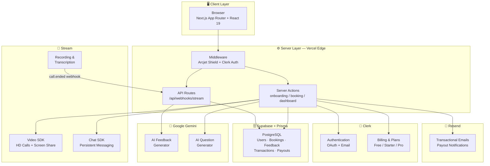
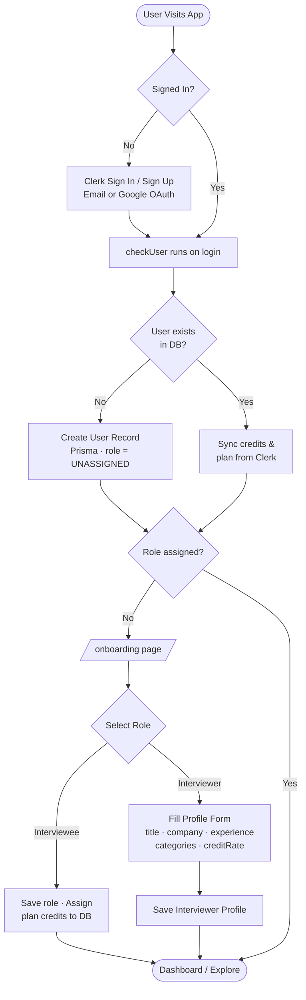
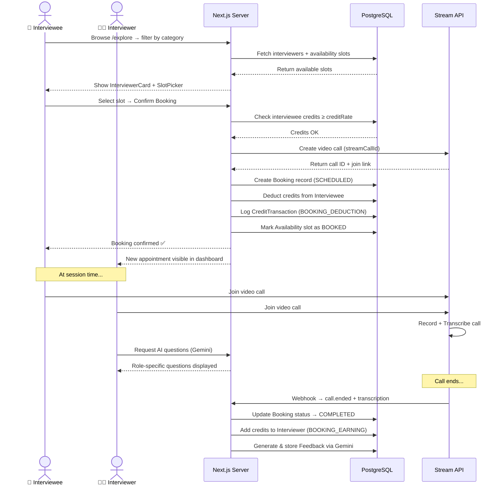
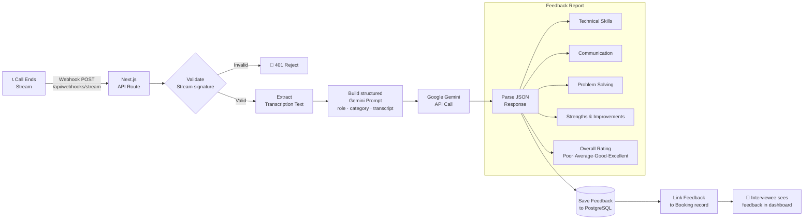
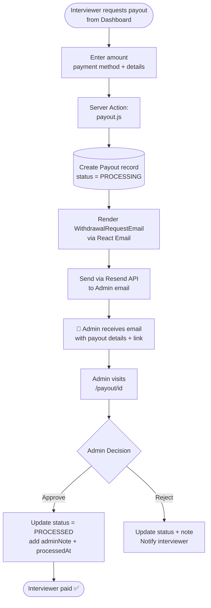
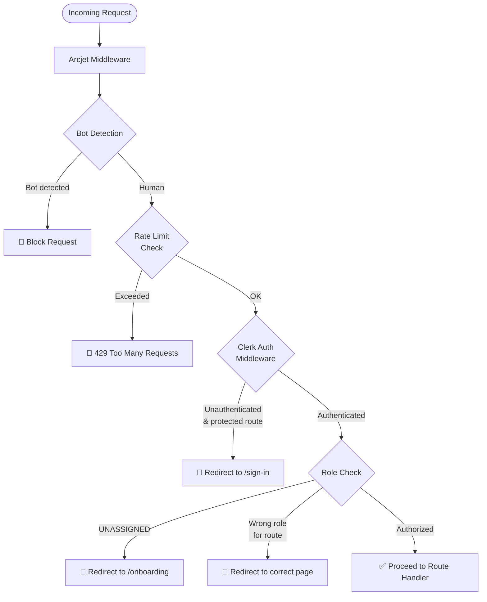

<div align="center">


# 🎯 Prept — AI-Powered Interview Platform

**A full-stack, production-ready interview preparation marketplace where candidates meet expert interviewers, powered by real-time AI.**

[](https://prept-ai-interview-platform.vercel.app/)
[](https://github.com/Saket22-CS/ai-interview-platform.git)
[](https://nextjs.org/)
[](LICENSE)

</div>

---

## 📌 Table of Contents

- [Overview](#-overview)
- [Live Demo](#-live-demo)
- [Key Features](#-key-features)
- [Tech Stack](#-tech-stack)
- [Architecture](#-architecture)
- [Database Schema](#-database-schema)
- [Project Structure](#-project-structure)
- [Getting Started](#-getting-started)
- [Environment Variables](#-environment-variables)
- [Email Notifications](#-email-notifications)
- [Security](#-security)
- [Subscription Plans](#-subscription-plans)
- [Deployment](#-deployment)
- [Screenshots](#-screenshots)
- [Author](#-author)

---

## 🌟 Overview

**Prept** is a comprehensive AI-powered interview preparation marketplace built entirely from scratch. It bridges the gap between candidates preparing for technical interviews and experienced interviewers, offering a seamless end-to-end platform that includes:

- 🎥 **Live HD Video Interviews** with screen sharing and persistent chat
- 🤖 **AI-Generated Feedback Reports** powered by Google Gemini
- 🧠 **Real-time AI Question Generator** for interviewers during live calls
- 💳 **Credit-based Booking System** with subscription tiers
- 📊 **Interviewer Earnings Dashboard** with payout management
- 📧 **Automated Email Notifications** via Resend & React Email

This project represents hundreds of hours of design, development, and engineering effort — from database schema design to real-time video integration to AI pipeline architecture.

---

## 🔗 Live Demo

> 🌐 **[https://prept-ai-interview-platform.vercel.app/](https://prept-ai-interview-platform.vercel.app/)**

---

## ✨ Key Features

### 👤 Dual Role System
- Users onboard as either **Interviewee** or **Interviewer**
- Interviewers set up rich profiles: title, company, years of experience, domain categories, credit rate
- Interviewees browse and filter interviewers by specialty, name, and company

### 📅 Booking & Scheduling
- Interviewers define daily availability slots
- Interviewees pick available 45-minute slots from a dynamic slot picker
- Real-time credit deduction on booking confirmation
- Automatic Stream video call creation on booking

### 🎥 HD Video Call Experience
- **Stream SDK** powers real-time video with screen sharing, recording, and transcription
- Persistent in-call chat with history
- AI Question Tab visible to interviewers — generates role-specific questions on demand during the call
- Post-call recordings available for **Pro** plan users

### 🤖 AI-Powered Feedback (Google Gemini)
- Call transcription is automatically processed post-session
- Google Gemini generates a comprehensive feedback report covering:
  - Technical skills
  - Communication
  - Problem-solving
  - Strengths & areas of improvement
  - Overall rating: `Poor` / `Average` / `Good` / `Excellent`
- Feedback is viewable via a modal in the appointments dashboard

### 🧠 AI Interview Question Generator
- Interviewers can trigger AI question generation during the call
- Dynamic prompts based on the interviewee's role and category
- Powered by Google Gemini API

### 💳 Credit & Subscription System
- Three subscription tiers managed via **Clerk Billing**
- Credits deducted from interviewee and credited to interviewer per session
- Interviewers can request payouts from their dashboard
- Admin approval workflow with email notification via **Resend**

### 📧 Email Notifications (Resend + React Email)
- Withdrawal request emails sent to admin when an interviewer requests a payout
- Beautiful, templated emails built with `@react-email/components`
- Rendered server-side and dispatched via the Resend API
- Email template located at `emails/WithdrawalRequestEmail.jsx`

### 📊 Interviewer Dashboard
- Track total earnings, credit balance, and withdrawal history
- Manage availability slots (add/remove)
- View upcoming and past appointments
- Request payouts with payment method and details

### 🔐 Authentication (Clerk)
- Sign in / Sign up with Google OAuth and email
- Role-based routing and redirection
- Subscription and billing plan management
- User profile synchronization with the database on every login

### 🛡️ Security & Rate Limiting (Arcjet)
- Arcjet middleware protects all API routes and private pages
- Shield protection against common web attacks
- Rate limiting to prevent abuse and DOS attacks
- Bot detection and filtering

---

## 🛠️ Tech Stack

| Category | Technology |
|---|---|
| **Framework** | Next.js 16.2.2 (App Router) |
| **Language** | JavaScript (ES2024+) |
| **Styling** | Tailwind CSS v4, ShadCN UI, Radix UI |
| **Animation** | Motion (Framer Motion v12), tw-animate-css |
| **Database** | PostgreSQL via Supabase |
| **ORM** | Prisma v7 |
| **Auth & Billing** | Clerk (OAuth, subscriptions, user management) |
| **Video & Chat** | Stream Video React SDK, Stream Chat React |
| **AI / LLM** | Google Gemini API (`@google/generative-ai`) |
| **Email** | Resend + React Email |
| **Security** | Arcjet (rate limiting, bot protection, shield) |
| **Icons** | Lucide React |
| **Notifications** | Sonner (toast notifications) |
| **Syntax Highlighting** | Shiki |
| **Date Utilities** | date-fns |
| **Deployment** | Vercel |

---

## 🏗️ Architecture

### 🗺️ System Overview



---

### 🔄 User Authentication & Onboarding Flow



---

### 📅 Booking & Credit Flow



---

### 🤖 AI Feedback Pipeline



---

### 💸 Payout & Email Notification Flow



---

### 🛡️ Security & Middleware Flow



---

## 🗄️ Database Schema

Designed with **Prisma ORM** on **PostgreSQL (Supabase)**:

```prisma
model User {
  id              String   @id @default(cuid())
  clerkUserId     String   @unique
  email           String   @unique
  name            String?
  imageUrl        String?
  role            Role     @default(UNASSIGNED)  // UNASSIGNED | INTERVIEWEE | INTERVIEWER
  credits         Int      @default(0)
  currentPlan     String?
  bio             String?
  title           String?
  company         String?
  yearsExperience Int?
  categories      String[]
  creditRate      Int?
  creditBalance   Int      @default(0)
  earnings        Int      @default(0)
}

model Availability {
  id           String           @id @default(cuid())
  interviewerId String
  startTime    DateTime
  endTime      DateTime
  status       AvailabilityStatus  // AVAILABLE | BOOKED | BLOCKED
}

model Booking {
  id             String        @id @default(cuid())
  interviewerId  String
  intervieweeId  String
  startTime      DateTime
  endTime        DateTime
  status         BookingStatus // SCHEDULED | COMPLETED | CANCELLED
  creditsCharged Int
  streamCallId   String?
  recordingUrl   String?
  feedbackId     String?
}

model Feedback {
  id              String  @id @default(cuid())
  bookingId       String  @unique
  summary         String
  technical       String
  communication   String
  problemSolving  String
  recommendation  String
  strengths       String[]
  improvements    String[]
  overallRating   Rating  // POOR | AVERAGE | GOOD | EXCELLENT
  sessionComment  String?
}

model CreditTransaction {
  id              String          @id @default(cuid())
  userId          String
  amount          Int
  transactionType TransactionType // CREDIT_PURCHASE | BOOKING_DEDUCTION | BOOKING_EARNING | ADMIN_ADJUSTMENT
  bookingId       String?
}

model Payout {
  id              String       @id @default(cuid())
  interviewerId   String
  creditsRequested Int
  platformFee     Int
  netAmount       Int
  paymentMethod   String
  paymentDetails  String
  status          PayoutStatus // PROCESSING | PROCESSED
  adminNote       String?
  processedAt     DateTime?
  processedBy     String?
}
```

---

## 📁 Project Structure

```
ai_interview_marketplace/
├── actions/                    # Next.js Server Actions
│   ├── aiQuestions.js          # Gemini AI question generation
│   ├── appointments.js         # Appointment fetching logic
│   ├── booking.js              # Slot booking + credit deduction
│   ├── call.js                 # Stream call creation/management
│   ├── dashboard.js            # Interviewer dashboard data
│   ├── explore.js              # Interviewer search & filtering
│   ├── onboarding.js           # User role & profile setup
│   ├── payout.js               # Payout request handling
│   └── user.js                 # User sync & credit management
│
├── app/
│   ├── (auth)/                 # Clerk auth pages (sign-in, sign-up)
│   ├── (main)/
│   │   ├── appointments/       # Interviewee appointment list + feedback
│   │   ├── call/[callId]/      # Live video call room
│   │   │   └── _components/
│   │   │       ├── AIQuestions.jsx     # AI question panel
│   │   │       ├── CallRoom.jsx        # Stream video room
│   │   │       └── CallUI.jsx          # UI wrapper with tabs
│   │   ├── dashboard/          # Interviewer dashboard
│   │   │   └── _components/
│   │   │       ├── AppointmentsSection.jsx
│   │   │       ├── AvailabilitySection.jsx
│   │   │       └── EarningsSection.jsx
│   │   ├── explore/            # Browse interviewers
│   │   ├── interviewers/[id]/  # Interviewer profile + booking
│   │   ├── onboarding/         # Role selection + profile form
│   │   └── payout/[id]/        # Payout review page
│   ├── api/webhooks/stream/    # Stream webhook → AI feedback trigger
│   └── page.jsx                # Landing page
│
├── components/
│   ├── ui/                     # ShadCN UI components
│   ├── animate-ui/             # Animated backgrounds & code blocks
│   ├── AppointmentCard.jsx
│   ├── CreditButton.jsx
│   ├── FeedbackModal.jsx
│   ├── PricingSection.jsx
│   ├── RoleRedirect.jsx
│   ├── UpgradeModal.jsx
│   └── header.jsx
│
├── emails/
│   └── WithdrawalRequestEmail.jsx  # React Email payout template
│
├── hooks/
│   ├── use-fetch.js            # Async data fetching hook
│   ├── use-controlled-state.jsx
│   └── use-is-in-view.jsx
│
├── lib/
│   ├── arcjet.js               # Arcjet security config
│   ├── checkUser.js            # User sync on login
│   ├── data.js                 # Static data (categories etc.)
│   ├── helpers.js              # Utility helpers
│   ├── prisma.js               # Prisma client singleton
│   └── utils.js                # Class merging utilities
│
├── prisma/
│   ├── schema.prisma           # Full DB schema
│   ├── seed.js                 # Database seeding script
│   └── migrations/             # SQL migration history
│
└── public/                     # Static assets (logos, hero images)
```

---

## 🚀 Getting Started

### Prerequisites

- Node.js `>= 18.x`
- PostgreSQL database (Supabase recommended)
- Accounts for: Clerk, Stream, Google AI Studio, Arcjet, Resend

### Installation

```bash
# 1. Clone the repository
git clone https://github.com/Saket22-CS/ai-interview-platform.git
cd ai-interview-platform

# 2. Install dependencies
npm install

# 3. Set up environment variables
cp .env.example .env.local
# Fill in all required keys (see below)

# 4. Push database schema
npx prisma db push

# 5. (Optional) Seed the database
node prisma/seed.js

# 6. Run the development server
npm run dev
```

Open [http://localhost:3000](http://localhost:3000) in your browser.

---

## 🔐 Environment Variables

Create a `.env.local` file with the following:

```env
# ─── Database ───────────────────────────────────────
DATABASE_URL=postgresql://...             # Supabase connection string

# ─── Clerk Auth & Billing ───────────────────────────
NEXT_PUBLIC_CLERK_PUBLISHABLE_KEY=pk_...
CLERK_SECRET_KEY=sk_...
NEXT_PUBLIC_CLERK_SIGN_IN_URL=/sign-in
NEXT_PUBLIC_CLERK_SIGN_UP_URL=/sign-up
NEXT_PUBLIC_CLERK_AFTER_SIGN_IN_URL=/onboarding
NEXT_PUBLIC_CLERK_AFTER_SIGN_UP_URL=/onboarding

# ─── Stream (Video + Chat) ──────────────────────────
NEXT_PUBLIC_STREAM_API_KEY=...
STREAM_API_SECRET=...

# ─── Google Gemini AI ───────────────────────────────
GEMINI_API_KEY=...

# ─── Arcjet Security ────────────────────────────────
ARCJET_KEY=...

# ─── Resend Email ───────────────────────────────────
RESEND_API_KEY=...
ADMIN_EMAIL=your-admin@email.com
```

---

## 📧 Email Notifications

The platform uses **Resend** + **React Email** for transactional email.

### Payout Request Flow

When an interviewer submits a withdrawal request:

1. The `payout.js` server action creates a `Payout` record in the database
2. A `WithdrawalRequestEmail` React component is rendered server-side
3. The rendered HTML is sent to the admin email via **Resend API**
4. Admin reviews the payout at `/payout/[id]` and updates the status

### Email Template

Located at `emails/WithdrawalRequestEmail.jsx`, built with `@react-email/components`:

```jsx
import { Html, Body, Heading, Text, Section } from '@react-email/components';

export default function WithdrawalRequestEmail({ interviewer, amount, paymentMethod }) {
  return (
    <Html>
      <Body>
        <Heading>New Withdrawal Request</Heading>
        <Section>
          <Text>Interviewer: {interviewer.name}</Text>
          <Text>Amount: {amount} credits</Text>
          <Text>Payment Method: {paymentMethod}</Text>
        </Section>
      </Body>
    </Html>
  );
}
```

---

## 🛡️ Security

Security is a first-class concern in this platform:

| Layer | Implementation |
|---|---|
| **Route Protection** | Clerk middleware blocks unauthenticated access to all `/main/*` routes |
| **Role-Based Access** | `RoleRedirect` component enforces role-specific page access |
| **API Rate Limiting** | Arcjet limits requests per IP to prevent abuse |
| **Bot Protection** | Arcjet shield detects and blocks malicious bots |
| **DOS Protection** | Arcjet shield middleware on all API routes |
| **Server-Side Logic** | Sensitive operations (credit deduction, bookings) run exclusively in Server Actions |

---

## 💎 Subscription Plans

| Plan | Price | Monthly Credits | Features |
|---|---|---|---|
| **Free** | $0/mo | 1 credit | 1 mock interview session, HD video call, persistent chat |
| **Starter** | $29/mo | 5 credits | 5 sessions, AI feedback report, credit rollover |
| **Pro** | $69/mo | 15 credits | 15 sessions, all Starter features + **session recording & playback** |

- Credits roll over for Starter and Pro plans
- Plans managed entirely via **Clerk Billing** (no custom payment logic needed)
- Interviewers earn credits per session based on their set `creditRate`

---

## ☁️ Deployment

This project is deployed on **Vercel** with the following setup:

```bash
# Build command
next build

# Post-install (auto-runs on Vercel)
prisma generate
```

**Vercel Configuration:**
- Add all environment variables in the Vercel dashboard
- Enable Edge Functions for middleware (Arcjet + Clerk)
- Connect Supabase as the PostgreSQL provider
- Add Stream webhook URL: `https://your-domain.vercel.app/api/webhooks/stream`

---

## 🧰 Tools & Extensions Used

| Tool | Purpose |
|---|---|
| **Prisma Studio** | Visual database explorer during development |
| **Vercel CLI** | Deployment and environment management |
| **Postman** | API testing for webhooks and server actions |
| **Supabase Dashboard** | Database monitoring and query inspection |
| **Arcjet Dashboard** | Security event monitoring |
| **Stream Dashboard** | Video call analytics and webhook configuration |
| **React Email Preview** | Local email template development & preview |

---

## 📸 Screenshots

> Visit the live demo: [https://prept-ai-interview-platform.vercel.app/](https://prept-ai-interview-platform.vercel.app/)

- 🏠 Animated landing page with starry background
- 🔍 Explore page with search + category filters
- 📅 Slot picker with live availability
- 🎥 Video call room with AI question tab
- 📊 Interviewer earnings dashboard
- 📝 AI feedback modal with detailed report

---

## 👨‍💻 Author

**Saket** — Full Stack Developer

Built with ❤️, countless cups of coffee, and a relentless drive to ship production-quality software.

[](https://github.com/Saket22-CS)
[](https://prept-ai-interview-platform.vercel.app/)

---

<div align="center">

**⭐ If you found this project useful, please star the repository!**

</div>